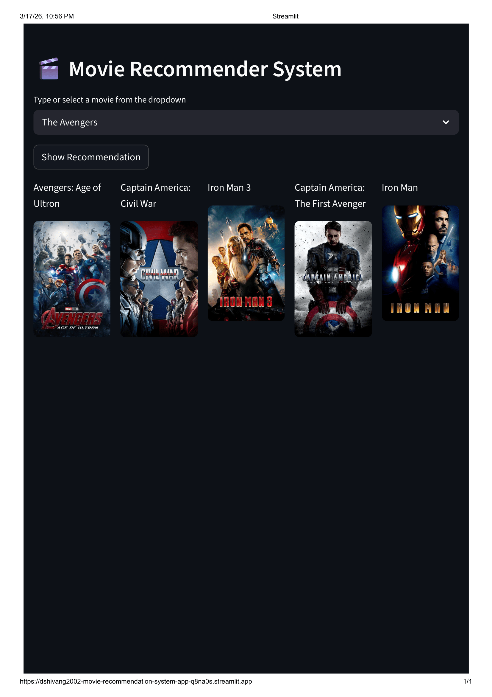

# 🎬 Movie Recommendation System
 
A content-based movie recommendation system built using **NLP and Machine Learning** that suggests 5 similar movies based on the one you select — complete with movie posters fetched live from the TMDB API.
 
🔗 **Live Demo:** [Click here to try the app](https://dshivang2002-movie-recommendation-system-app-q8na0s.streamlit.app/)
 
---

## About the Project
 
This project takes a movie selected by the user and recommends **5 most similar movies** based on content — genres, keywords, cast, crew, and plot overview. The recommendations are powered by NLP vectorization and cosine similarity, and the app displays each recommendation along with its **movie poster fetched in real-time** from the TMDB API.
 
---

## App Demo
 
### 🦸 The Avengers → Marvel recommendations
> Selected: **The Avengers** | Got: Avengers: Age of Ultron, Captain America: Civil War, Iron Man 3, Captain America: The First Avenger, Iron Man
 

 
---
 
### 🧙 Harry Potter and the Half-Blood Prince → Full HP series
> Selected: **Harry Potter and the Half-Blood Prince** | Got: Order of the Phoenix, Prisoner of Azkaban, Goblet of Fire, Chamber of Secrets, Philosopher's Stone
 
)
 
---
 
### 🦸‍♂️ X-Men: The Last Stand → X-Men universe
> Selected: **X-Men: The Last Stand** | Got: X2, X-Men, Days of Future Past, X-Men Origins: Wolverine, X-Men: First Class
 

 
> The model correctly identifies franchise continuity — all recommendations for Harry Potter are Harry Potter films, all X-Men recommendations are X-Men films. This validates that the content-based approach using cast, crew, genres and keywords works accurately.
 
---

## Project Flow
 
```
TMDB 5000 Movies + Credits Dataset (CSV)
            │
            ▼
    Data Merging & Cleaning
    └── Merge movies + credits on title
    └── Select relevant columns (movie_id, title, overview,
        genres, keywords, cast, crew)
    └── Drop null values
            │
            ▼
    Feature Extraction & Preprocessing
    └── Parse JSON-like string columns → Python lists
        (genres, keywords, cast, crew)
    └── Extract top 3 cast members only
    └── Extract only Director from crew
    └── Remove spaces in names to avoid token conflicts
        (e.g. "Sam Worthington" → "SamWorthington")
            │
            ▼
    Tag Creation (NLP)
    └── Combine overview + genres + keywords + cast + crew
        into a single "tags" column per movie
            │
            ▼
    Vectorization
    └── CountVectorizer (top 5000 features, English stopwords removed)
    └── Convert tags into feature vectors
            │
            ▼
    Similarity Computation
    └── Cosine Similarity matrix across all 4800+ movies
            │
            ▼
    Model Serialization
    └── Save movie_list.pkl and similarity.pkl using Pickle
            │
            ▼
    Streamlit Web App
    └── User selects a movie from dropdown
    └── Top 5 similar movies fetched from similarity matrix
    └── Movie posters fetched live via TMDB API
    └── Results displayed in a 5-column layout
```
 
---

## Tech Stack
 
| Layer | Tools |
|-------|-------|
| Language | Python |
| Data Handling | Pandas, NumPy |
| NLP & ML | Scikit-learn (CountVectorizer, Cosine Similarity) |
| Data Parsing | ast (JSON-string parsing) |
| Model Saving | Pickle |
| Web App | Streamlit |
| Poster Fetching | TMDB API + Requests |
 
---

## Dataset
 
**TMDB 5000 Movie Dataset** (Kaggle)
- `tmdb_5000_movies.csv` — movie metadata (genres, keywords, overview, etc.)
- `tmdb_5000_credits.csv` — cast and crew information
 
Both files are merged on the `title` column and trimmed to 7 key columns for processing.
 
---
## How It Works
 
### Step 1 — Data Collection & Merging
The project uses two datasets from TMDB — one containing movie metadata (genres, keywords, overview, etc.) and another containing cast and crew information. These two datasets are merged on the `title` column to bring all relevant information into a single dataframe. After merging, only 7 columns are kept: `movie_id`, `title`, `overview`, `genres`, `keywords`, `cast`, and `crew` — everything else is dropped.
 
---
 
### Step 2 — Parsing JSON-like String Columns
Columns like `genres`, `keywords`, `cast`, and `crew` are stored as **JSON-formatted strings** inside the CSV (e.g., `[{"id": 28, "name": "Action"}, ...]`). These need to be converted into usable Python lists before any processing can happen.
 
- For `genres` and `keywords` — all names are extracted from the JSON into a plain list: `["Action", "Adventure", "Fantasy"]`
- For `cast` — only the **top 3 actors** are extracted to keep the signal strong and avoid noise from minor roles
- For `crew` — only the **Director** is extracted by filtering rows where `job == 'Director'`
 
---
 
### Step 3 — Removing Spaces Inside Names
A critical preprocessing step: multi-word names like `"Sam Worthington"` or `"James Cameron"` are collapsed into single tokens — `"SamWorthington"` and `"JamesCameron"`.
 
**Why this matters:** If spaces are kept, the vectorizer treats `"Sam"` and `"Worthington"` as two separate unrelated words. By joining them, the model understands `"SamWorthington"` as one unique identity — so two movies sharing the same actor are correctly identified as similar based on that actor.
 
---
 
### Step 4 — Tag Creation
All the processed features for each movie are combined into a **single text string** called `tags`:
 
```
tags = overview words + genres + keywords + top 3 cast + director
```
 
For example, Avatar's tag would look something like:
 
```
"In 22nd century paraplegic Marine dispatched moon Pandora ...
Action Adventure Fantasy ScienceFiction cultureclash spacewar
SamWorthington ZoeSaldana SigourneyWeaver JamesCameron"
```
 
This single string now represents the entire identity of a movie in text form — its story, its genre, its people.
 
---
 
### Step 5 — Vectorization (Bag of Words)
The `tags` column is fed into **CountVectorizer** from scikit-learn, which:
- Builds a vocabulary of the **top 5000 most frequent words** across all movie tags
- Removes common English stop words (`the`, `is`, `and`, etc.) that carry no meaning
- Converts each movie's tag string into a **numerical vector** of length 5000, where each value represents how many times a word appears in that movie's tag
 
The result is a matrix of shape `(4800+ movies × 5000 features)` — each row is a movie represented as numbers.
 
---
 
### Step 6 — Cosine Similarity
Once all movies are represented as vectors, **Cosine Similarity** is computed between every pair of movies.
 
Cosine similarity measures the **angle between two vectors** rather than their magnitude. Two movies with very similar tags will have vectors pointing in nearly the same direction, giving a similarity score close to **1**. Movies with nothing in common will have a score close to **0**.
 
The output is a similarity matrix of shape `(4800 × 4800)` — every cell `[i][j]` holds the similarity score between movie `i` and movie `j`.
 
---
 
### Step 7 — Generating Recommendations
When a user selects a movie:
1. The app finds the movie's index in the dataframe
2. It fetches that movie's row from the similarity matrix — a list of similarity scores against all other movies
3. The scores are sorted in descending order
4. The **top 5 results** (excluding the movie itself at index 0) are returned as recommendations
 
---
 
### Step 8 — Fetching Posters via TMDB API
For each recommended movie, the app uses its `movie_id` to call the **TMDB API** and fetch the poster image URL. The app includes retry logic — if the API call fails due to network issues or rate limits, it automatically retries up to 3 times before falling back to a placeholder image. The 5 recommendations and their posters are then displayed side by side in the Streamlit UI.
 
---
 
### Step 9 — Model Serialization
The processed movie dataframe (`movie_list.pkl`) and the full similarity matrix (`similarity.pkl`) are saved using **Pickle** so the Streamlit app can load them instantly without recomputing everything on each run.
 
---

## Dataset
 
**TMDB 5000 Movie Dataset** (Kaggle)
- `tmdb_5000_movies.csv` — movie metadata (genres, keywords, overview, etc.)
- `tmdb_5000_credits.csv` — cast and crew information
 
Both files are merged on the `title` column and trimmed to 7 key columns for processing.
 
---
## Project Structure
 
```
Movie_Recommendation_System/
│
├── notebook.ipynb        # Full pipeline: EDA, preprocessing, NLP, model building
├── app.py                # Streamlit web application
├── movie_list.pkl        # Serialized movie dataframe
├── similarity.pkl        # Serialized cosine similarity matrix
└── README.md
```
 
---


## Setup & Run Locally
 
```bash
# 1. Clone the repository
git clone https://github.com/your-username/Movie_Recommendation_System.git
cd Movie_Recommendation_System
 
# 2. Install dependencies
pip install pandas numpy scikit-learn streamlit requests
 
# 3. Run the app
streamlit run app.py
```
 
> **Note:** The `movie_list.pkl` and `similarity.pkl` files must be present in the root directory. These are generated by running `notebook.ipynb` end-to-end with the TMDB dataset CSVs.
 
---
 
*Dataset sourced from Kaggle — TMDB 5000 Movie Dataset. Posters fetched via the TMDB public API.*
